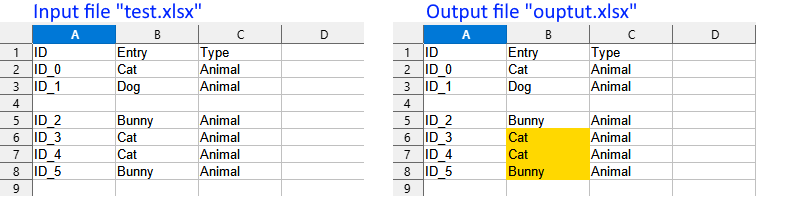

# HighlightRepeats
[](https://www.gnu.org/licenses/gpl-3.0)

Python program that highlights repeating text in a spreadsheet column.

## Installation

*HighlightRepeats* is a standalone executable. No specific installation is needed. Simply download the ZIP-archive of the [latest release](https://github.com/kruizer23/highlight_repeats/releases) and extract it.

## Usage

Type `HighlightRepeats -h` for help information:

```
usage: HighlightRepeats [-h] [-d] infile outfile column

Python program that highlights repeating text in a
spreadsheet column.

positional arguments:
  infile       input spreadsheet file
  outfile      output spreadsheet file
  column       column to check

options:
  -h, --help   show this help message and exit
  -d, --debug  enable debug messages on the standard output

```

## Example

Assume the following input file called `test.xlsx` and you run the command:

* `HighlightRepeats test.xlsx output.xlsx 2`

The generated `output.xlsx` then looks like:




## Reference

The following command was used to create the standalone executable with [Pyinstaller](https://pyinstaller.org):

* `pyinstaller source\HighlightRepeats\app.py --onefile --name HighlightRepeats`
